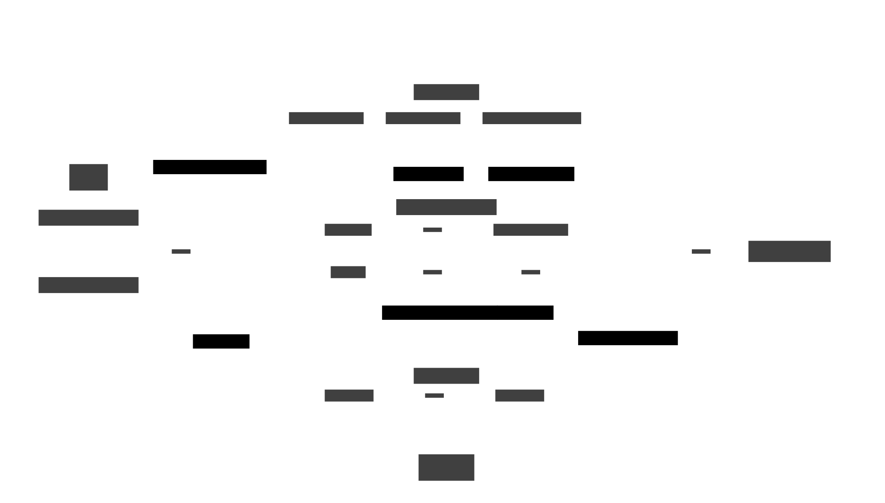

# BackServer 설계도

 

# UserFlow

 

# Idea

 

# ReserTalbe 사업 계획서

## 1. 목적  
    > 식당 예약 서비스 통합, 및 테이블링의 독과점 견제를 통한 소비자 이익 추구

## 2. 목표
 - 테이블링, 캐치테이블 등의 식당 예약 서비스 통합
 - 자체 테이블 예약 시스템을 통한 테이블 예약 사업 참여
 - 비교 시스템을 통한 소비자의 편리성 향상

 

## 3. 세부실시내용
### 대     상
- 식당 업주 및 테이블 예약 시스템 이용자
### 목표 달성 
- ReserTable 등록 업장 30여 곳
### 플  랫 폼 
- 웹 앱
### 담당 인력 
- 주민재, 하인우

### 진행 내용

- 플랫폼 
    1. 웹 앱 기반 개발을 통한 크로스 플랫폼 서비스 
    2. 추후 네이티브 앱 개발 가능성 고려
- 예약 비교 시스템
    1. 테이블링 및 캐치테이블 등의 예약 정보 관련 제휴
    2. 외부 리소스를 통한 식당 리스트 개발
    3. 평가 등의 외부 요인을 고려한 노출 수 조절

- 자체 식당 예약 시스템 
    1. 운영시간 - 10:00~22:00
    2. 운영장소 - 1층 로비와 식당
    3. 메뉴 - 잔치국수, 떡볶이, 꼬치 오뎅, 치킨+감자, 골뱅이, 부침개,주류 등 
- 비즈니스 모델 구현
    1. 운영시간 - 10:00~19:00  
    2. 운영장소 - 1층 정원